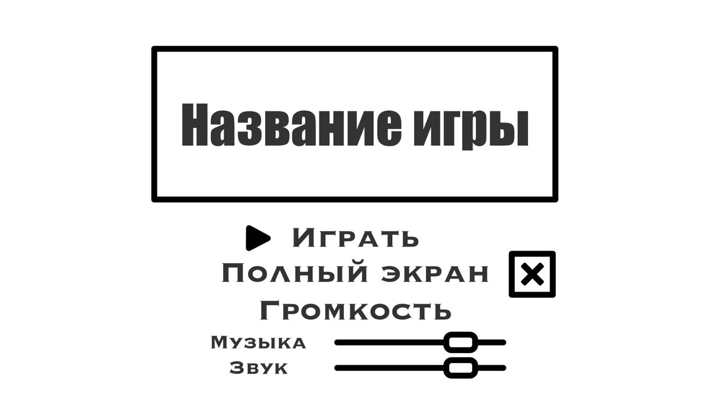
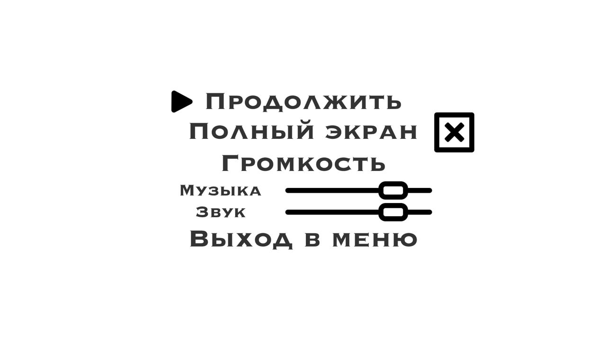
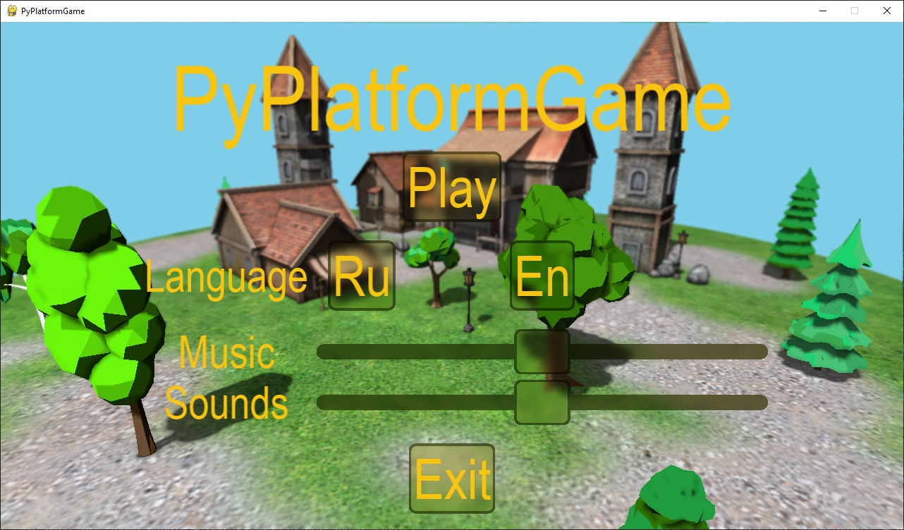
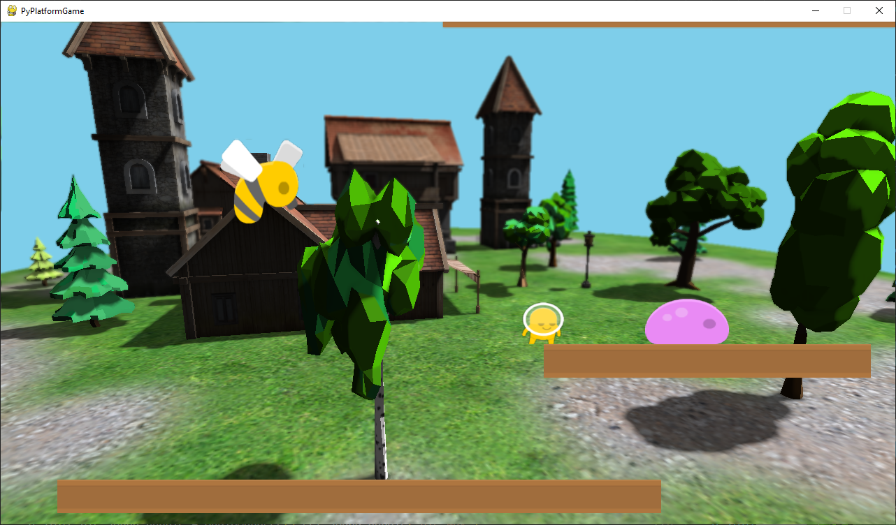
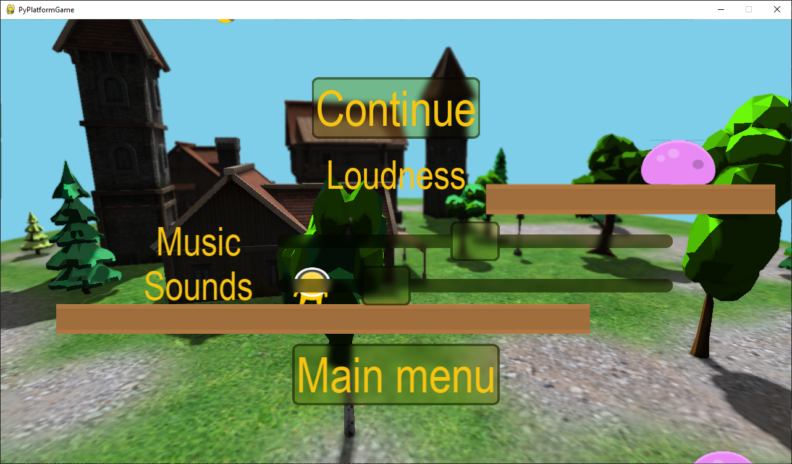

## 1. Постановка задачи:

### 2.5D платформер. Управляемый игроком персонаж может бегать и прыгать по платформам, нанося урон противникам.

## 2. Фичи:
 - Увлекательный геймплей)
 - Обработка ввода игрока
 - Простой ИИ противников
 - 3D рендер на OpenGL
 - Звуки и музыка

## 3. Список сторонных модулей:
 - PyOpenGL для рендера
 - PyGame для получения ввода и музыки
 - PyAssimp для загрузки 3D моделей
 - Pillow для загрузки текстур
 - NumPy и PyGLM для математики

## 4. Макет интерфейса и описание элементов
- Меню. Можно запустить игру, настроить громкость и полноэкранный режим
- В процессе игры из интерфейса присутствует только полоса здоровья игрока
- Есть меню паузы, позволяющее поменять настройки и вернуться в главное меню

# Пользовательская документация

## В игре можно встретить несколько пользовательских интерфейс-экранов:
- Стартовый\Меню (Домашний экран). На нем можно произвести смену языка игры (RU\ENG), настроить громкость звуков и музыки, а также выключить или же начать игру.

- Экран игровой сессии с игровым уровнем, врагами, главным персонажем и 3Д сценой.

- Экран паузы. На нем можно настроить громкость звуков и игровой музыки, а также продолжить игру или же вернуться в Меню.

- Экраны победы и поражения. На них возможно вернуться в меню и перезапустить игровую сессию.

## Описание игровой сессии
- Главная задача это уничтожить всех врагов в сцене. 
- Для передвижения влево и вправо требуется зажимать клавиши A и D соответственно. Прыжок = пробел. 
- Будьте внимательны, падение в пропасть приведет к смерти!
- Также если вы заденете врага ваш герой умрет.
- Для того чтобы уничтожить врага, нужно направить на него оружие нажав клавишу P 

